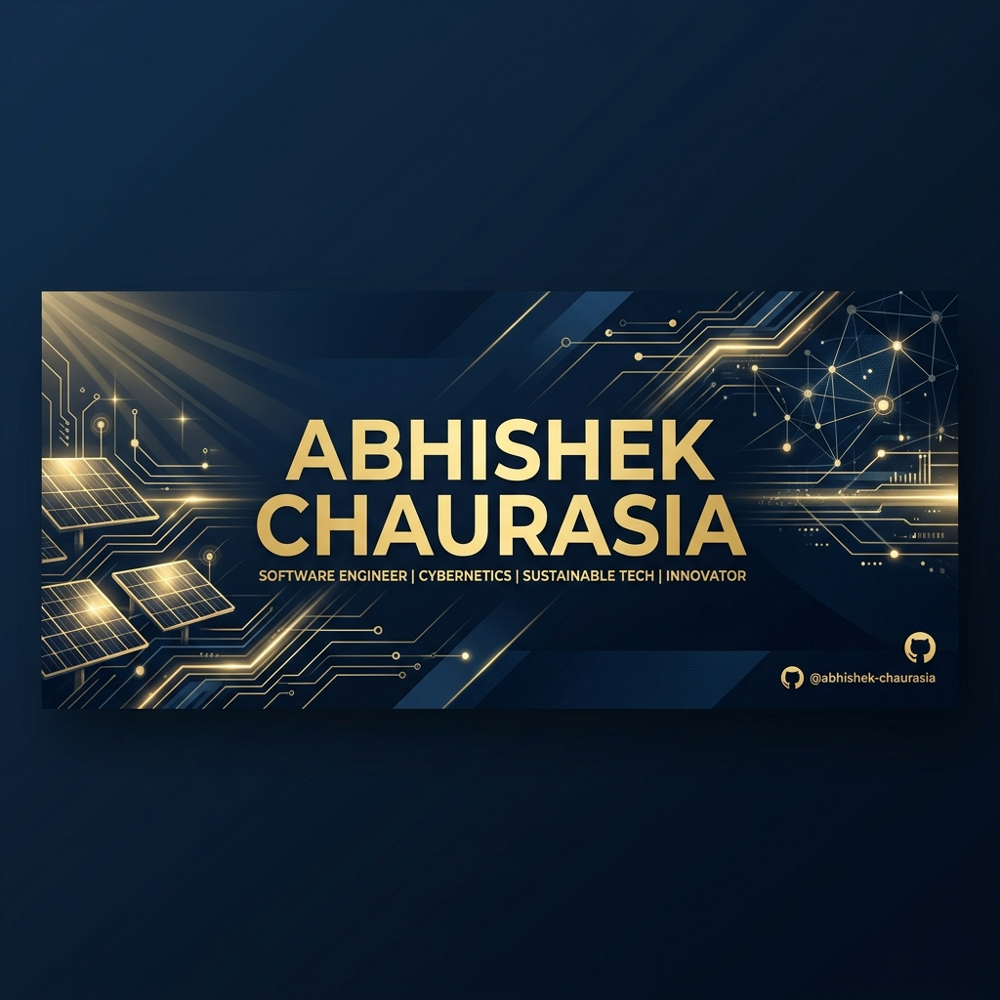

# 🚀 Abhishek Chaurasia
### **Full-Stack Engineer | Cybernetics & Sustainable Tech Innovator**

---

### 🛡️ Institutional Infrastructure & Digital Transformation
*Architecting high-fidelity systems with an emphasis on engineering excellence, security, and performance.*

## 🧬 Core Domain & Expertise

<table border="0">
  <tr>
    <td width="50%">
      <h3>📱 Mobile & Cross-Platform</h3>
      
Specializing in <b>Flutter & Dart</b> to build high-performance, institutional mobile applications with "Tesla-grade" UI/UX.

    </td>
    <td width="50%">
      <h3>🌐 Full-Stack Architecture</h3>
      
Building robust backends with <b>PHP & Node.js</b>, coupled with modern frontend frameworks for seamless enterprise integration.

    </td>
  </tr>
  <tr>
    <td width="50%">
      <h3>🌍 Sustainable Engineering</h3>
      
Implementing digital infrastructure for <b>Solar Energy</b> and <b>Cybernetic</b> systems to drive institutional growth.

    </td>
    <td width="50%">
      <h3>🏗️ DevOps & Scalability</h3>
      
Automation-first approach using professional workflows, CI/CD pipelines, and secure cloud management.

    </td>
  </tr>
</table>

---

## 🛠️ Technical Toolbox

| Category | Technologies |
| :--- | :--- |
| **Languages** | `Dart` `PHP` `JavaScript` `TypeScript` `HTML5` `CSS3` |
| **Frameworks** | `Flutter` `Next.js` `React` `Express.js` `Laravel` |
| **Databases** | `PostgreSQL` `MongoDB` `Redis` `Firebase` |
| **Tools** | `Git` `Docker` `AWS` `GCP` `Postman` `Figma` |

---

## 📊 Shipping Metrics & Activity

  
  

 

  

---

## 📬 Institutional Connectivity

If you are looking to collaborate on high-fidelity projects or require institutional-grade engineering solutions, feel free to reach out.

- 📧 **Email:** `chaurasiaabhishek847@gmail.com`
- 💬 **LinkedIn:** [Abhishek Chaurasia](https://linkedin.com/in/abhishek)
- 🌐 **Portfolio:** [Portfolio](https://abhishekchaurasia847.github.io/portfolio)

  <i>"Efficiency is doing things right; Effectiveness is doing the right things."</i>

