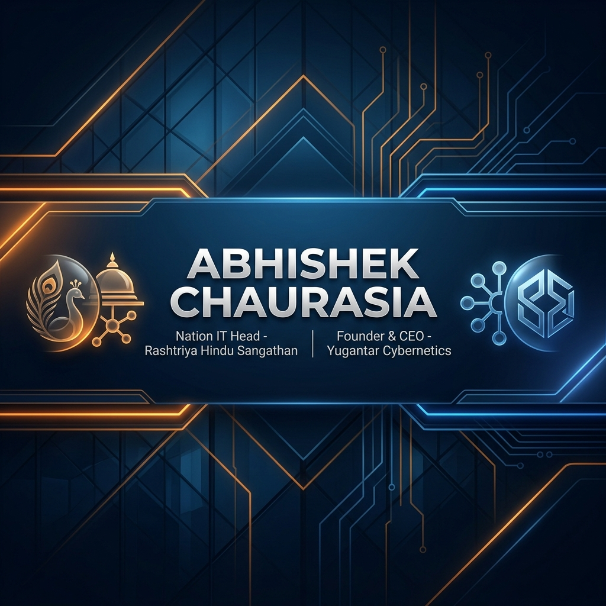

# 🏛️ Abhishek Chaurasia
### **Nation IT Head — Rashtriya Hindu Sangathan**
### **Founder & CEO — Yugantar Cybernetics Private Limited**

---

### 🛡️ Strategic Executive Command Center
*Leading National Digital Transformation & Architecting the Future of Cybernetics*

## 🌐 Leadership Dashboard

<table border="0" align="center">
  <tr>
    <td width="50%" bgcolor="#20232a">
      <h2 align="center">🚩 Nation IT Head</h2>
      
<b>Rashtriya Hindu Sangathan</b>

      <ul align="left">
        <li>🚀 <b>National Strategy:</b> Architecting secure digital infrastructure for organizational growth.</li>
        <li>🛡️ <b>Cyber Sovereignty:</b> spearheading IT protocols and national digital outreach.</li>
        <li>📊 <b>Ecosystem Management:</b> Scaling IT operations across national chapters.</li>
      </ul>
      

        
      

    </td>
    <td width="50%" bgcolor="#20232a">
      <h2 align="center">🏢 Founder & CEO</h2>
      
<b>Yugantar Cybernetics Pvt. Ltd.</b>

      <ul align="left">
        <li>💡 <b>Innovation & R&D:</b> Leading cutting-edge development in AI, IoT, and Cybernetics.</li>
        <li>📈 <b>Venture Growth:</b> Driving the company's vision from prototype to institutional-grade systems.</li>
        <li>🧬 <b>Product Architecture:</b> Managing the "Solar-Elite" and "Institutional" product lines.</li>
      </ul>
      

        
      

    </td>
  </tr>
</table>

---

## ⚡ Technical Pulse & Ecosystem

  
  

 

  

---

## 🛠️ Global Technology Stack

| Domain | Institutional-Grade Technologies |
| :--- | :--- |
| **Enterprise Core** | `Dart` `Flutter` `PHP` `Next.js` `TypeScript` |
| **Systems & Data** | `PostgreSQL` `MongoDB` `Redis` `Firebase` |
| **Infrastructure** | `AWS Cloud` `Docker` `Nginx` `CI/CD Pipelines` |
| **Institutional Design** | `Figma` `Canva` `Interactive UI/UX` |

---

## 📬 Strategic Connectivity

For critical collaboration, national IT initiatives, or corporate partnerships, reach out through the executive channels below.

- 📧 **Direct Contact:** `chaurasiaabhishek847@gmail.com`
- 💼 **LinkedIn Profile:** [Abhishek Chaurasia](https://linkedin.com/in/abhishek)
- 🏢 **Corporate HQ:** [Yugantar Cybernetics](https://yugantar.cybernetics)

  <i>"Vision is the art of seeing things invisible." — Jonathan Swift</i>

